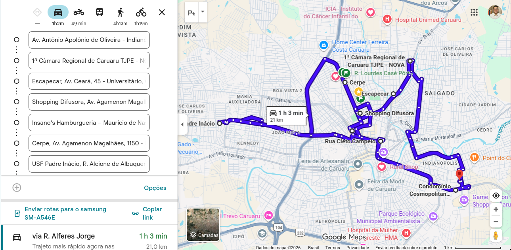

# Court Officer Routing System

Optimizing judicial efficiency through mathematical programming and real-time geospatial data.

---

## Overview

The Court Officer Routing System is a specialized tool built to optimize the weekly schedule of a **Court Officer** (*Oficial de Justiça*). It models the problem as a **Vehicle Routing Problem with Time Windows (VRPTW)**, ensuring that judicial mandates are served not only via the shortest path, but strictly within each mandate's required time window.

---

## Features

- **VRPTW Optimization** — A Mixed Integer Linear Programming model that enforces time constraints for every delivery and visit.
- **Real-World Traffic Data** — Integrates with the Google Routes API or Open Source Routing Machine (OSRM) to fetch real travel durations and distances.
- **Automated Scheduling** — Produces a structured document detailing the full optimized daily agenda for the week.
- **Smart Navigation Links** — Generates Google Maps URLs for every route. To work around Google's waypoint limit, long routes are automatically split into sequential links of up to 10 points each, ensuring seamless turn-by-turn navigation.

---

## Tech Stack

| Component | Technology |
|---|---|
| Language | Python 3.x |
| Optimization | [Pyomo](http://www.pyomo.org/) (MILP) |
| External APIs | Google Routes API |

---

## How It Works

```
Addresses & Time Windows & Service Time
        │
        ▼
  Routes API
  (Distance & Time Matrix)
        │
        ▼
  Pyomo MILP Solver
  (Minimize total travel time)
        │
        ▼
  Weekly Report + Google Maps Links
```

1. **Input** — Provide a list of up to **25 geographical points** (judicial mandates) along with their required time windows.
2. **Geocoding & Matrix** — The system queries the Google Routes API or OSRM to build a complete distance and travel-time matrix between all points.
3. **Optimization** — The Pyomo model applies MILP constraints to find the globally optimal schedule that minimizes total travel time while respecting every time window.
4. **Output** — A structured weekly report is generated, complete with sequential Google Maps navigation links ready for field use.

---

## Getting Started

### Prerequisites

- Python 3.x
- A valid **Routes API** key for Google Routes API
- A supported MILP solver (e.g., [HiGHS](https://highs.dev/), [CPLEX](https://www.ibm.com/br-pt/products/ilog-cplex-optimization-studio), or [Gurobi](https://www.gurobi.com/)). The project was developed and tested with CPLEX — other solvers may require minor configuration changes.

### Installation

```bash
git clone https://github.com/Josa9321/CourtOfficer-VRPTW
cd CourtOfficer-VRPTW
pip install -r requirements.txt
```

### Configuration

Create a file named `.api` in the project root directory containing your Google Routes API key if it will be used:
```
your_api_key_here
```

### Usage

#### Generating an Instance (via OSRM)

To build a distance and time matrix from a set of real addresses, use the `get_geodata_osrm` function. The `duplicate_base` option duplicates the first address as the last, representing the depot at both the start and end of the route.

```python
import vrptw

addresses_set = [
        "Avenida Antônio Apolônio de Oliveira, Caruaru Pernambuco",
        "Cosmopolitan Shopping Caruaru Pernambuco",
        "Rua Cleto Campelo Caruaru Pernambuco",
        "Tribunal de Justiça de Pernambuco 1ª Câmara Regional",
        "Shopping Difusora Caruaru Pernambuco",
        "Insano's Hamburgueria Caruaru Pernambuco",
        "Escapecar Caruaru Pernambuco",
        "Cerpe Avenida Agamenon Magalhães Caruaru Pernambuco",
        "Unidade de Saúde da Família Padre Inácio Caruaru Pernambuco",
        ]

durations, distances = vrptw.get_geodata_osrm(addresses, duplicate_base=True)
```

The following code continues from above, showing how to assemble and save an instance file ready for solving:

```python
import numpy as np

V = range(durations.shape[0])

time_point = np.array([10 * 60.0 for _ in V])  # 10 min service time per point
time_point[0] = 0.0   # depot has no service time
time_point[-1] = 0.0

a = np.array([0.0 for _ in V])             # earliest arrival: midnight
b = np.array([8 * 60 * 60.0 for _ in V])  # latest arrival: 8h from midnight
b[-1] = 9 * 60 * 60.0                     # depot closing time: 9h

addresses.append(addresses[0])  # close the route back at the depot

instance = vrptw.Instance(durations, distances, time_point, a, b, addresses)
instance.save('instanceOSRM.json')
```

---

#### Command Line (Solving an Instance)

Pass a JSON instance file as argument. A solution file prefixed with `solution_` will be generated in the same directory.

```bash
python run.py instance.json  # generates solution_instance.json
```

Optional flags:

| Flag | Default | Description |
|---|---|---|
| `-v` | 0 | Prints solver details during optimization |
| `-g` | 0 | Generates Google Maps navigation links for the routes — only use if addresses are real and valid |


For example, to solve the `instanceOSRM.json` generated above with `-g` enabled:

```bash
python run.py instance.json -g 1
```

This produces a Google Maps navigation link for each day's route. The link and resulting map for this example are shown below:

[Open Route in Google Maps](https://www.google.com/maps/dir/?api=1&origin=Avenida%20Ant%C3%B4nio%20Apol%C3%B4nio%20de%20Oliveira%2C%20Caruaru%20Pernambuco&destination=Avenida%20Ant%C3%B4nio%20Apol%C3%B4nio%20de%20Oliveira%2C%20Caruaru%20Pernambuco&waypoints=Tribunal%20de%20Justi%C3%A7a%20de%20Pernambuco%201%C2%AA%20C%C3%A2mara%20Regional|Escapecar%20Caruaru%20Pernambuco|Shopping%20Difusora%20Caruaru%20Pernambuco|Insano%27s%20Hamburgueria%20Caruaru%20Pernambuco|Cerpe%20Avenida%20Agamenon%20Magalh%C3%A3es%20Caruaru%20Pernambuco|Unidade%20de%20Sa%C3%BAde%20da%20Fam%C3%ADlia%20Padre%20In%C3%A1cio%20Caruaru%20Pernambuco|Rua%20Cleto%20Campelo%20Caruaru%20Pernambuco|Cosmopolitan%20Shopping%20Caruaru%20Pernambuco)



---

#### REST API (Solving an Instance)

Start the Flask server:

```bash
flask --app api.py run
```

Then, send a POST request to the `/solve` endpoint with the instance as the JSON body. A ready-to-use script is provided exemplifying the process:

```bash
python example_api.py
```

---

<!-- ## License -->
<!---->
<!-- This project is licensed under the [MIT License](LICENSE). -->
<!---->
